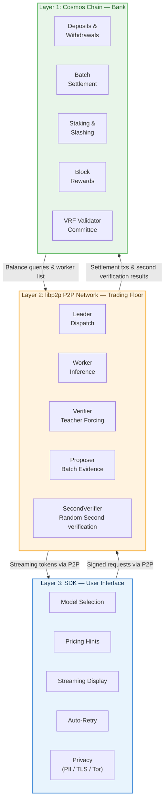
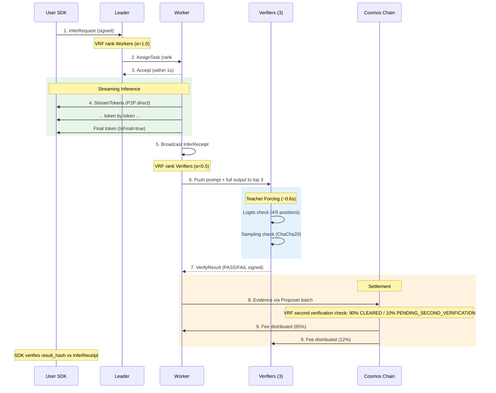
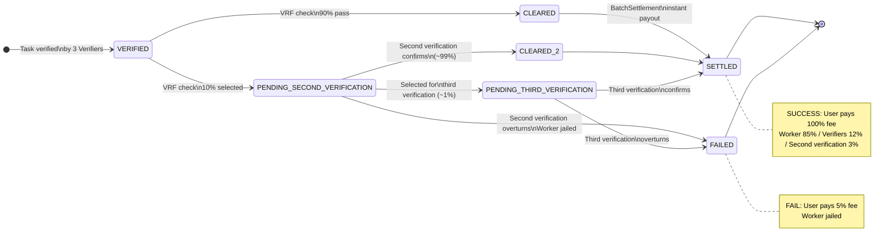

# FunAI: A Decentralized AI Inference Network

**Version 1.0 | April 2026**

---

## Abstract

FunAI is a decentralized network for AI inference that separates settlement from computation. The chain acts as a bank — handling deposits, withdrawals, staking, and reward distribution — while all inference happens off-chain over a peer-to-peer network. This "Lightning Scheme" design, inspired by Bitcoin's Lightning Network, enables the network to scale to over one million inferences per second without being bottlenecked by blockchain throughput.

Every inference result is cryptographically verified through teacher forcing, deterministic sampling, and random second verification. Workers stake FAI tokens to participate, and the protocol's incentive structure ensures that cheating is economically irrational. The system is permissionless: anyone with a GPU and sufficient stake can join.

---

## Table of Contents

1. [Introduction](#1-introduction)
2. [Architecture](#2-architecture)
3. [Lightning Scheme](#3-lightning-scheme)
4. [Inference Pipeline](#4-inference-pipeline)
5. [Verification Protocol](#5-verification-protocol)
6. [VRF-Based Selection](#6-vrf-based-selection)
7. [Security Model](#7-security-model)
8. [Token Economics](#8-token-economics)
9. [Model Registry](#9-model-registry)
10. [Privacy](#10-privacy)
11. [SDK and Developer Experience](#11-sdk-and-developer-experience)
12. [Performance and Scalability](#12-performance-and-scalability)
13. [Governance and Upgrades](#13-governance-and-upgrades)
14. [Conclusion](#14-conclusion)

---

## 1. Introduction

### 1.1 The Problem

Centralized AI inference services present three fundamental issues:

- **Single points of failure.** When a provider goes down, all dependent applications fail.
- **Censorship and access control.** Providers can restrict access to models, regions, or use cases at will.
- **Opaque pricing.** Users have no visibility into actual compute costs and no competitive market pressure on fees.

Existing decentralized approaches — optimistic rollups, ZK rollups, state channels — either introduce unacceptable latency (7-day challenge periods), require impractical compute overhead (ZK proofs of GPU inference), or don't match the one-to-many topology of AI inference.

### 1.2 Core Principles

FunAI is built on five first principles:

1. **The work done is correct.** Seed determined → logits determined → sampling determined (ChaCha20 + shared seed) → output determined → hash determined. Full-chain determinism makes cheating structurally impossible.
2. **Cannot stop.** No single point of failure affects service. Even if all inference halts, the chain only handles settlement.
3. **Anyone can join.** Permissionless. GPU + staked FAI = Worker.
4. **Those who cannot survive will die.** Market-driven pricing. The protocol does not intervene.
5. **The chain is a bank, not an exchange.** The chain handles deposits, settlements, and staking. The entire inference process is off-chain.

### 1.3 Relationship with Bitcoin

FunAI draws on Bitcoin's economic security philosophy: making cheating unprofitable, rather than preventing cheating. But AI inference introduces three challenges that Bitcoin does not face:

| Challenge | Bitcoin | FunAI Solution |
|-----------|---------|----------------|
| Workers not working | Miners not mining doesn't affect others | Jail mechanism |
| Probabilistic correctness | Transactions are valid or invalid | Epsilon tolerance + P99.9 false-positive control |
| Quality fraud | No "poor quality" transactions | Random second verification |

---

## 2. Architecture

### 2.1 Three-Layer Design

FunAI separates concerns into three distinct layers:



**Layer 1 (Chain)** processes only low-frequency financial operations: deposits, withdrawals, batch settlements, staking, and block rewards. It uses CometBFT consensus with a VRF-selected 100-validator committee, producing blocks every 5 seconds.

**Layer 2 (P2P)** handles all high-frequency inference traffic over libp2p. Messages are routed by `model_id` topics. Leaders dispatch tasks, Workers execute inference, and Verifiers validate results — all without touching the chain.

**Layer 3 (SDK)** provides an OpenAI-compatible API for developers. It handles request signing, streaming, automatic retry, privacy (PII sanitization, encryption, Tor routing), and fee estimation — entirely client-side.

### 2.2 On-Chain Operations

| Message | Purpose |
|---------|---------|
| `MsgDeposit` | User deposits FAI to inference balance |
| `MsgWithdraw` | User or Worker withdraws funds |
| `MsgRegisterWorker` | Worker registers with stake, GPU info, supported models |
| `MsgModelProposal` | Propose a new model with epsilon tolerance |
| `MsgDeclareInstalled` | Worker declares a model installed |
| `MsgBatchSettlement` | Proposer submits batch of CLEARED task settlements |
| `MsgSecondVerificationResult` | Second verification/third-verification verification results |
| `MsgFraudProof` | User SDK reports content mismatch |
| `MsgUnjail` | Unjail a penalized node |

### 2.3 Network Roles

Every registered Worker can dynamically serve multiple roles, selected by VRF:

| Role | Function | Selection |
|------|----------|-----------|
| **Worker** | Executes AI inference on GPU | VRF rank #1 per task (alpha=1.0) |
| **Verifier** | Teacher forcing + logits/sampling check | VRF top 3 per task (alpha=0.5) |
| **SecondVerifier** | Random re-verification of cleared tasks | VRF random 15-20 candidates (alpha=0.0) |
| **Leader** | Dispatches tasks for a model topic | VRF per model, 30s epoch (alpha=1.0) |
| **Proposer** | Batches settlements on-chain | CometBFT rotation |
| **Validator** | Signs and proposes blocks | VRF 100-person committee (alpha=1.0) |

---

## 3. Lightning Scheme

### 3.1 Why Not Settle Every Transaction On-Chain

Each inference would require 5-6 on-chain transactions. CometBFT handles ~2,000 TPS. That limits inference to ~400 TPS — 2,500x short of the million-TPS target. The chain becomes the ceiling.

### 3.2 Design

FunAI's Lightning Scheme is analogous to Bitcoin's Lightning Network: the chain handles deposits and settlements; inference happens off-chain. But it is simpler:

- **No bidirectional channels** — user payments are one-way
- **No routing** — not a multi-hop network
- **No penalty transactions** — expired signatures automatically become void

### 3.3 Pre-Deposit Account

Users deposit to an on-chain inference balance before sending requests:

```
MsgDeposit { user: address, amount: uint128 }
```

One deposit supports hundreds of inferences. Depositing is low-frequency (weekly/monthly), not a TPS bottleneck.

### 3.4 Signed Request Flow

Users sign inference requests off-chain with their secp256k1 private key. The signed request includes `model_id`, `prompt_hash`, `fee`, `expire_block`, `temperature`, and `user_seed`. The `task_id = hash(user_pubkey + model_id + prompt_hash + timestamp)` uniquely identifies each task and can only be settled once on-chain.

### 3.5 Three-Layer Overspend Protection

Since requests travel through P2P rather than on-chain, a time gap exists between request and deduction:

1. **Leader local tracking:** `available = on_chain_balance - local_pending_total`
2. **Worker self-check:** Balance < fee x 3x safety factor → reject
3. **On-chain fallback:** Insufficient balance at settlement time → entry REFUNDED, skip

### 3.6 Signature Expiration

`expire_block` defaults to current block height + 17,280 (24 hours). Within this window, the Worker gathers evidence and submits settlement. After expiry, the signature becomes void — no one can deduct from the user's balance. Safety is automatic.

The SDK applies tiered expiration based on expected output:

| Task Size | Expiration |
|-----------|-----------|
| < 1,000 tokens | 360 blocks (30 minutes) |
| 1,000 - 10,000 tokens | 1,440 blocks (2 hours) |
| > 10,000 tokens | 4,320 blocks (6 hours) |

Hard cap: 17,280 blocks (24 hours).

---

## 4. Inference Pipeline

### 4.1 End-to-End Flow



1. User signs and sends `InferRequest` to the Leader for the target model
2. Leader computes VRF ranking, assigns to rank #1 available Worker
3. Worker accepts within 1 second, executes inference, streams tokens directly to user via P2P
4. Worker broadcasts `InferReceipt` (containing logits at sampled positions, final seed, sampled tokens)
5. Worker pushes prompt + complete output to VRF-selected top 3 Verifiers
6. Verifiers run teacher forcing (~0.6s), check logits and sampling, sign PASS/FAIL
7. Proposer collects evidence and batches settlements on-chain

### 4.2 Leader Dispatch

- **Election:** VRF selects 1 Leader per `model_id` every 30 seconds (alpha=1.0)
- **Dispatch cycle:** 100ms batches from mempool
- **Accept timeout:** 1 second per Worker, up to 3 fallback ranks
- **Failover:** 1.5s inactivity → all Workers switch to rank #2
- **Auto-split:** At TPS > 500, sub-topics are created: `N = ceil(recent_tps / 500)`

### 4.3 Assignment vs. Competition

Normal flow is assignment: one task, one Worker. If the Worker fails to deliver, the SDK retries with the same `task_id`, and the Leader assigns a new Worker. Multiple Workers may complete the same task, but only the first to settle gets paid. This creates a natural market incentive for speed without requiring penalty mechanisms.

---

## 5. Verification Protocol

### 5.1 Teacher Forcing

For each task, 3 Verifiers are selected by VRF (alpha=0.5). Each Verifier receives the prompt and complete output, then runs a single forward pass with the output as forced input — "teacher forcing." This takes approximately 0.6 seconds regardless of output length.

### 5.2 Logits Verification

At 5 VRF-selected token positions, the Verifier compares the Worker's reported logits against its own computation. If 4 out of 5 positions match within the model's epsilon tolerance, the logits check passes.

### 5.3 Deterministic Sampling Verification

When temperature > 0, an additional sampling verification ensures the Worker actually sampled from the correct distribution:

```
final_seed = SHA256(user_seed || dispatch_block_hash || task_id)
PRNG: ChaCha20 (RFC 8439)
Math: float32 throughout
Softmax accumulation: token_id 0 to vocab_size-1 (strict order)
```

The Verifier regenerates the sampling sequence using the deterministic seed and ChaCha20 PRNG. Combined mismatch across logits and sampling must be <= 2 positions to pass; >= 3 triggers failure.

Top-p (nucleus) sampling is supported: tokens are sorted by probability descending, accumulated until the threshold is reached, and excluded tokens are zeroed and renormalized — all in float32.

### 5.4 Settlement State Machine



Second verification and third-verification rates are dynamic, adjusted per epoch based on network conditions:
- Second-verification rate: 5% - 30% (base: 10%)
- Third-verification rate: 0.5% - 5% (base: 1%)

---

## 6. VRF-Based Selection

### 6.1 Unified Formula

All role selection uses a single formula:

```
score = hash(seed || pubkey) / stake^alpha
```

Lower score = higher rank. The `alpha` parameter controls how much stake influences selection:

| Use Case | Alpha | Seed | Effect |
|----------|-------|------|--------|
| Dispatch | 1.0 | `task_id \|\| block_hash` | Proportional to stake |
| Verification | 0.5 | `task_id \|\| result_hash` | Proportional to sqrt(stake) |
| Second verification | 0.0 | `task_id \|\| post_verification_block_hash` | Equal probability |
| Third verification | 0.0 | `task_id \|\| post_second verification_block_hash` | Equal probability |
| Leader election | 1.0 | `model_id \|\| sub_topic_id \|\| epoch_block_hash` | Stake-weighted |
| Validator committee | 1.0 | `epoch_block_hash` | Stake-weighted |

### 6.2 Design Rationale

- **Dispatch (alpha=1.0):** Pure stake weight prevents whale account-splitting (splitting yields zero benefit). Income volatility for small holders is addressed through delegation pools, not VRF tuning.
- **Verification (alpha=0.5):** weighted by `sqrt(stake × reputation × latency_factor)`. sqrt allows small GPUs to participate (verification only takes ~0.6s) while reducing collusion probability; rep × speed still contribute.
- **Second/Third verification (alpha=0.0):** weighted by `reputation × latency_factor` — **stake excluded**. Stake cannot buy selection probability, so whale or Sybil stake concentration offers no advantage; the attacker must earn genuine reputation and fast-latency behavior across many nodes, which is substantially harder than accumulating stake. This makes 2nd/3rd-tier verification the final Sybil-resistant firewall.

### 6.3 Effective Weight

VRF ranking incorporates stake, reputation, and a latency factor. The exact formula depends on the role:

```
effective_stake      = stake × reputation × latency_factor       (Worker / 1st-tier verifier / Leader / Validator)
effective_repspeed   = reputation × latency_factor               (2nd/3rd-tier verifier — stake excluded)
```

Where:
- `reputation` is an on-chain node reliability score, range 0.0–1.2, default 1.0.
- `latency_factor` is a monotonic function of the node's `avg_latency_ms`: reference 3000 ms → factor 1.0, clamped to [0.1, 1.5] (faster → higher factor). Missing data → 1.0 (neutral).
- The role's **α** controls the **stake** exponent only; `reputation × latency_factor` is always applied at exponent 1.0 for non-stake roles, or folded into `effective_stake` for stake-weighted roles.

---

## 7. Security Model

### 7.1 Reputation System

Each Worker maintains a reputation score that directly affects VRF ranking:

| Event | Score Change |
|-------|-------------|
| Task accepted and completed | +0.01 |
| Worker miss (timeout/failure) | -0.10 |
| SecondVerifier miss | -0.20 |
| 10+ consecutive idle rejects | -0.05 |
| Hourly decay | +/-0.005 toward 1.0 |

The asymmetric penalty (10x miss vs. accept) creates strong incentive for reliability. Hourly decay gradually normalizes scores, allowing recovery from bad streaks.

### 7.2 Jail and Slashing

Progressive penalties follow the Cosmos validator jail model:

| Offense | Duration | Effect |
|---------|----------|--------|
| 1st jail | 120 blocks (~10 min) | Wait, then unjail |
| 2nd jail | 720 blocks (~1 hour) | Wait, then unjail |
| 3rd jail | Permanent | 5% stake slash + tombstone |

50 consecutive successful tasks reset the jail counter to zero.

**Fraud Proof:** If a user's SDK detects output mismatch (result hash doesn't match Worker's InferReceipt), a `MsgFraudProof` is submitted on-chain. This triggers immediate 5% stake slash and permanent tombstone — no appeals.

### 7.3 Threat Analysis

| Attack | Mitigation |
|--------|-----------|
| Worker returns garbage | Teacher forcing catches logits mismatch; 4/5 positions must match |
| Worker uses smaller model | Logits diverge by > 1.0 (vs. hardware epsilon < 0.01); caught immediately |
| Leader dispatches to colluder | Rankings are publicly recomputable; 30s rotation limits window |
| Verifier collusion | alpha=0.5 adds randomness; 3 independent verifiers required |
| SecondVerifier manipulation | alpha=0.0 (pure random); probability of controlling all 3 second verifiers is negligible |
| Sybil attack on model registry | Activation requires 2/3 stake ratio + 4 workers + 4 distinct operators |
| Overspend attack | Three-layer protection: Leader tracking, Worker self-check, on-chain fallback |
| Replay attack | `task_id` uniqueness enforced on-chain; `expire_block` voids old signatures |

---

## 8. Token Economics

### 8.1 FAI Token

| Property | Value |
|----------|-------|
| Symbol | FAI |
| Denom | ufai (1 FAI = 1,000,000 ufai) |
| Total Supply | 210 billion FAI |
| Block Reward | 4,000 FAI/block |
| Block Time | 5 seconds |
| Halving Period | 26,250,000 blocks (~4.16 years) |
| EVM Chain ID | 123123123 |
| Cosmos Chain ID | funai_123123123-3 |

### 8.2 Inference Fee Distribution

When a task is successfully settled:

| Recipient | Share |
|-----------|-------|
| Worker (executor) | 85% |
| Verifiers (3) | 12% (~4% each) |
| Multi-verification fund | 3% |

On failure (Worker caught cheating or output rejected), the user pays **15%** of the fee: 12% to verifiers and 3% to the multi-verification fund. The Worker is jailed. This 15% matches the non-worker share of a successful settlement and fully covers verification and second/third-verification overhead.

### 8.3 Block Reward Distribution

Epoch length: 100 blocks (500 seconds). The block-reward pool is split with the same 85/12/3 ratio as the inference fee, so economic incentives across fees and rewards are perfectly aligned.

**When inference activity exists:**
- **85% inference pool** — distributed to Workers by `w_i = 0.85 * (fee_i / total_fee) + 0.15 * (task_count_i / total_tasks)`
- **12% verifier pool** — distributed to all verifiers (1st-tier + 2nd + 3rd verifiers combined) by the same formula, with `fee_i` being the fee each verifier+second-verifier+third-verifier earned this epoch
- **3% multi-verification fund** — minted into the settlement module account and paid out per-epoch to 2nd/3rd verifiers via the multi-verification fund distribution mechanism (alongside fee-based fund accumulation)

**When no inference activity exists:**
- 100% distributed to consensus committee by blocks signed

### 8.4 Halving Schedule

```
reward(h) = base_reward * 0.5 ^ floor(h / halving_period)
```

| Year | Block Reward | Annual Issuance |
|------|-------------|-----------------|
| 0-4 | 4,000 FAI | ~25.2B FAI |
| 4-8 | 2,000 FAI | ~12.6B FAI |
| 8-12 | 1,000 FAI | ~6.3B FAI |
| 12-16 | 500 FAI | ~3.15B FAI |

### 8.5 Staking

- Minimum Worker stake: 10,000 FAI
- Exit unbonding period: 21 days (362,880 blocks)
- Slash on fraud/3rd jail: 5% of stake
- Stake is VRF weight, not a deposit — like Bitcoin miners' hashrate

---

## 9. Model Registry

### 9.1 Model Identity

```
model_id = SHA256(weight_hash || quant_config_hash || runtime_image_hash)
```

This cryptographic identity ensures that all Workers serving a model are running identical weights, quantization, and runtime. The epsilon tolerance is empirically tested by the model proposer across 100 prompts x 2+ GPU types x 3 runs, using P99.9.

### 9.2 Activation Thresholds

A model becomes active when:
- Installed stake ratio >= 2/3 of total network stake
- Worker count >= 4
- Unique operator count >= 4

A model can serve inference when:
- Installed stake ratio >= 2/3
- Worker count >= 10

The high operator requirement prevents a single entity from activating a model through sybil Workers.

### 9.3 Model Aliases

Human-readable aliases (e.g., `qwen3-32b-q4`) are globally unique, immutable, 3-64 characters, lowercase alphanumeric plus hyphens. The SDK resolves aliases to `model_id` hashes automatically.

---

## 10. Privacy

The SDK provides four privacy modes:

| Mode | Encryption | IP Anonymity | Use Case |
|------|-----------|--------------|----------|
| `plain` | None | None | Maximum performance |
| `tls` | AES-256-GCM | None | Default; protects prompt/output content |
| `tor` | None | Tor routing | Hides user identity |
| `full` | AES-256-GCM | Tor routing | Maximum privacy |

### 10.1 End-to-End Encryption

TLS mode uses X25519 ECDH key exchange with per-message ephemeral keys for forward secrecy. Each message generates a fresh X25519 keypair, derives a shared secret with the recipient's static public key, and encrypts using AES-256-GCM.

### 10.2 PII Sanitization

By default, the SDK automatically detects and removes personally identifiable information (email addresses, phone numbers, national IDs, credit card numbers) from prompts before sending. PII is replaced with indexed placeholders and automatically restored in the model output.

### 10.3 Data Retention

All participating nodes retain task data for 48 hours (reduced from 7 days for data minimization). This provides sufficient time for second verification while limiting exposure.

---

## 11. SDK and Developer Experience

### 11.1 OpenAI-Compatible API

The SDK provides a drop-in replacement for the OpenAI API:

```go
chat := client.NewChat()
resp, _ := chat.Completions.Create(ctx, sdk.ChatCompletionRequest{
    Model:       "qwen3-32b-q4",
    Messages:    messages,
    Temperature: 0.7,
    MaxTokens:   1024,
})
```

### 11.2 Features

- **Function calling:** Tool definitions injected into system prompt; tool call JSON parsed from output
- **JSON mode:** Automatic retry (up to 3 attempts) with constraint injection for guaranteed valid JSON
- **Streaming:** Token-by-token delivery via P2P with 5-second auto-retry on stall
- **Auto-pricing:** Queries on-chain average fee with 10% premium as default
- **Model discovery:** Query active models, worker counts, and average fees from chain state
- **Fraud verification:** Automatic result hash comparison with Worker's InferReceipt; submits FraudProof on mismatch

### 11.3 Error Handling

| Error | HTTP Status | Description |
|-------|------------|-------------|
| `insufficient_balance` | 402 | Deposit more FAI |
| `model_not_found` | 404 | Model not active |
| `no_available_worker` | 503 | No Workers online |
| `request_timeout` | 408 | Retries exhausted |
| `fee_too_low` | 422 | Below minimum |
| `invalid_parameters` | 400 | Bad request |

---

## 12. Performance and Scalability

### 12.1 Throughput

The Lightning Scheme removes the chain as a bottleneck. P2P throughput scales horizontally through Leader auto-splitting:

| Stage | TPS | Sub-Leaders | Workers |
|-------|-----|------------|---------|
| Early | 10 | 1 | 150 |
| Growth | 2,000 | 4 | 6,000 |
| Mature | 50,000 | 100 | 300,000 |
| Limit | 1,000,000 | 2,000 | 3,000,000 |

### 12.2 Latency

| Operation | Typical | Worst Case |
|-----------|---------|-----------|
| Dispatch (Leader → Worker) | < 50ms | 3s (3 fallbacks) |
| First token (Worker → User) | < 1s | Configurable per request |
| Verification (teacher forcing) | ~0.6s | 2s |
| Settlement (on-chain) | ~5s (1 block) | 15s (90% instant) |

### 12.3 Comparison

| Scheme | Settlement Delay | Verification Cost | TPS Limit | Suitable for AI Inference |
|--------|-----------------|-------------------|-----------|--------------------------|
| OP Rollup | 7 days | On-chain GPU | ~100K | No |
| ZK Rollup | Instant | Inference x1000 | ~1M | No (ZK-ML immature) |
| State Channel | Instant | Off-chain | ~1M | No (one-to-many mismatch) |
| FunAI Lightning | ~15s (90% instant) | ~5% of inference | ~1M | Yes |

---

## 13. Governance and Upgrades

### 13.1 On-Chain Governance

Protocol parameters are governable through on-chain proposals:
- Second verification and third-verification rates
- Reward distribution weights
- Stake minimums and slash percentages
- Model activation thresholds

### 13.2 Validator Committee

A 100-person validator committee is selected by VRF every 120 blocks (~10 minutes), weighted by stake. This provides decentralized block production while maintaining performance.

### 13.3 Reserved Interfaces

The following features are designed but not yet active, to be enabled as the network matures:

- **Delegation inference pools:** Analogous to Bitcoin mining pools — stake delegation for stable income, with on-chain `MsgDelegate` / `MsgUndelegate` and 21-day unbonding
- **Per-token billing:** Real-time billing with shadow balance, cross-verification of token counts, and anti-cheat mechanisms (governance toggle)

---

## 14. Conclusion

FunAI addresses the fundamental limitations of centralized AI inference — single points of failure, censorship, and opaque pricing — through a design that separates settlement from computation. The Lightning Scheme enables million-TPS throughput without blockchain bottlenecks. Full-chain deterministic verification through teacher forcing, ChaCha20 sampling, and random second verification ensures result integrity without trusting any single participant.

The protocol's security rests on economic incentives rather than cryptographic impossibility: cheating is not prevented — it is made unprofitable. This approach, proven by Bitcoin over 17 years, adapts naturally to AI inference with the addition of epsilon-tolerant verification and progressive penalties.

FunAI is permissionless, verifiable, and scalable. Anyone with a GPU can earn. Any developer can integrate via a familiar OpenAI-compatible API. The chain is a bank. The network is a marketplace. The math is the law.

---

**Resources:**
- GitHub: [github.com/funai-network/funai-chain](https://github.com/funai-network/funai-chain)
- Architecture Specification: `docs/protocol/FunAI_V52_Final.md`
- SDK Developer Guide: `docs/guides/SDK_Developer_Guide.md`
- Worker Operator Guide: `docs/guides/Worker_Operator_Guide.md`
